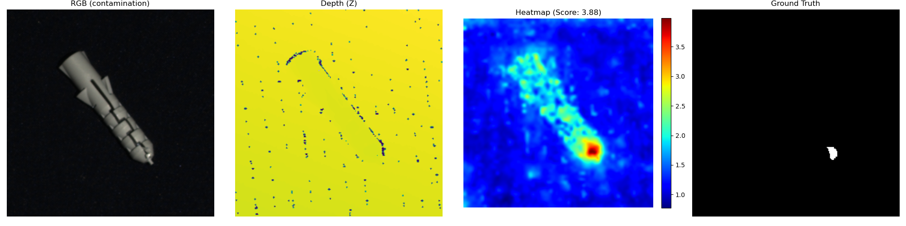
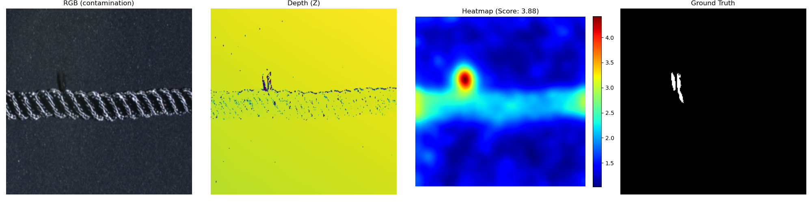
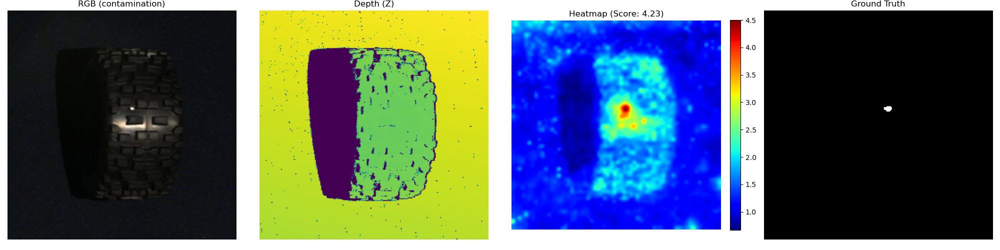
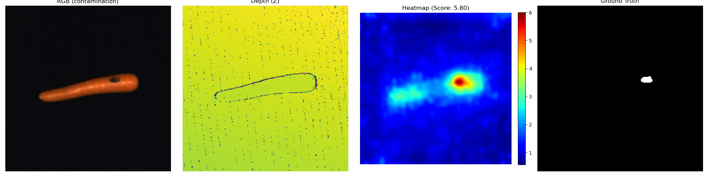
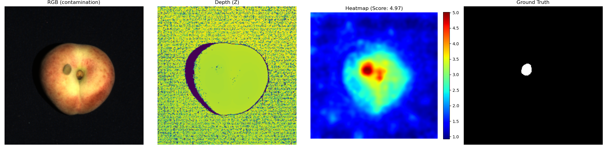
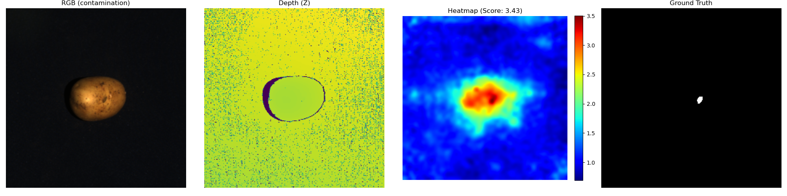

# 3D Industrial & Agricultural Defect Detection

基于多模态特征融合（2D RGB + 3D 点云空间信息）的复杂工业品与农产品表面缺陷检测框架。
该项目专为具有复杂表面拓扑与不规则纹理的目标设计，能够高精度检出刚体部件划痕以及农产品表面的碰冻伤与变质异常。

## 🌟 项目核心亮点 (Features)
本项目针对各类具有不同拓扑结构和表面纹理的产品，采用并在架构中集成了两套强大的异常检测算法，同时引入了“分类路由（Strategy Router）”模式，以实现单一代码库对不同材质物体的全覆盖检测：

1. **AST (Asymmetric Student-Teacher) 反向蒸馏模型基线**
   * **原理**：融合构建 Teacher 特征流形空间，利用 Student Decoder 试图重构无异常物体的特征；测试时通过两者之间拉开的特征差异/距离进行缺陷打分。
   * **适用场景**：规则刚体、无剧烈高频变化的物体（如 `dowel`）。
2. **Spatial PatchCore (3D 空间特征加强型 PatchCore)**
   * **原理**：使用 ResNet 抽取局部特征，同时加入经平滑后的 XYZ 绝对极坐标和 **基于伪 Sobel 差分计算的 3D 表面法向量(Surface Normals)**，构建致密的 K-Nearest 记忆特征库。在特征比对时用原生的 PyTorch `cdist` 实现了极速的 GPU 批次特征比对。
   * **适用场景**：纹理或点云具有极高频周期波动甚至无序孔隙的物体。法向量提取极大程度消除了模型对绝对 Z 轴深度的依赖，有效锁定了微观瑕疵（如 `foam`, `tire`, `rope`, `cable_gland`）。
3. **Category Router 智能路由系统**
   * 系统为不同类别定制了专用检测核和超参数（高斯平滑 `blur_radius`、池化 `top_k`、特征库下采样率 `subsample`、空间权重 `xyz_weight`），全自动匹配最优检测链路。

## 📊 评估结果指标 (Performance Metrics)
在最新的评估测试中，各类别的检测表现如下：

| 类别 (Category) | 测算策略与关键参数配置 | 样本级 AUROC (Sample) | 像素级 AUROC (Point) |
| :--- | :--- | :--- | :--- |
| `cable_gland` | Spatial PatchCore (`xyz_weight=15.0`) | **0.8331** | **0.9444** |
| `dowel` | Baseline ASTEvaluator 模型 | **0.9704** | **0.9967** |
| `foam` | PatchCore + 3D Feature (`blur_radius=2, top_k=5`) | **0.7575** | **0.9332** |
| `tire` | PatchCore + 3D Feature (`subsample=0.2, top_k=50`)| **0.7237** | **0.9878** |
| `rope` | PatchCore + 3D Feature (`blur_radius=8, top_k=400`) | **0.7867** | **0.9901** |
| `carrot` (农产品) | Spatial PatchCore (`xyz_weight=0.0, blur_radius=4, subsample=0.1`) | **0.9122** | **0.9938** |
| `potato` (农产品) | Spatial PatchCore (`xyz_weight=0.0, blur_radius=4, subsample=0.1`) | **0.8557** | **0.9961** |
| `peach` (农产品) | Spatial PatchCore (`xyz_weight=0.0, blur_radius=4, subsample=0.1`) | **0.8414** | **0.9936** |

## 📸 可视化结果展示 (Visualization)
系统自带特征热图自动生成功能。在模型推理完毕后，热力值可以直接反映出表面异常在三维与二维空间上的精确定位。

**下方展示了 `dowel`, `rope`, `tire`, `carrot`, `peach`, `potato` 的表面污染（Contamination）情况下的检测结果示例：**

工业产品


 
 
农业产品



*(注：图示自左向右依次为 RGB原图、Z轴原始点云深度图、检测出的异常热力图、真实的缺陷标注 Ground Truth)*

## 🛠️ 安装与环境 (Installation)
确保安装了可用的 CUDA 环境及匹配的 PyTorch。

```bash
# 推荐安装 miniconda，然后创建环境
conda create --name pytorch_gpu python==3.10

# 激活 conda 环境（此处示例名为 pytorch_gpu）
conda activate pytorch_gpu

# 安装必需依赖
pip install -r requirements.txt
```

## 🚀 快速使用 (Usage)
通过 `main.py` 一键启动检测与可视化。

### 基本指令
```bash
# 检测单个类别（例如：foam）
python main.py --categories foam

# 检测多个类别，并在 visualizations/ 文件夹下生成带热力图的可视化结果
python main.py --categories cable_gland dowel foam tire rope --visualize
```

### 运行参数介绍
* `--categories`：指定要检测的 MVTec 3D-AD 物品类别，可传入多个，按空格分隔。
* `--visualize`：开启此项后，模型跑完评估将会利用模型所得的热力阵列与背景掩模（Mask），以非常直观的方式在 `visualizations/` 目录下生成各类的 `RGB 原图 | 深度 Z 图 | 缺陷热力图 | 缺陷 Ground Truth` 拼接检测图。
* `--raw_data_root`：指定数据根目录（默认为 `./data/MVTec3D-AD`）。
* `--batch_size`：测试及加载时使用的批次大小，预设为 `4`。
* `--save_model`：运行评估后将构建好的特征记忆库 (Feature Bank) 或训练好的权重保存到 `checkpoints/` 目录下。
* `--load_model`：跳过训练与记忆库构建过程，直接从 `checkpoints/` 目录下加载已保存的模型文件进行快速推断测试。

## 📂 项目结构 (Structure)
```text
3D_IndustrialDefectDetection/  
├── data/                         # 数据集目录 (需手动下载 MVTec 3D-AD 后解压至此)
│   └── MVTec3D-AD/
│       ├── cable_gland/          # 每一种类别自成一个独立文件夹 (如 dowel, tire等)
│       │   ├── train/            # 训练集
│       │   │   └── good/         # 无异常的正常训练样本
│       │   │       ├── rgb/      # 2D 彩色图像 (.png)
│       │   │       └── xyz/      # 3D 深度坐标轴图像 (.tiff)
│       │   ├── test/             # 测试集
│       │   │   ├── good/         # 正常测试样本 (格式同上)
│       │   │   ├── bent/         # 各类带有不同瑕疵类型的异常样本
│       │   │   │   ├── gt/       # Ground Truth 像素级掩码标签 (仅在缺陷件测试集中存在)
│       │   │   │   ├── rgb/
│       │   │   │   └── xyz/
│       │   │   └── ...           # 其他缺陷类型 (如 cut, hole 等)
│       │   └── validation/       # 验证集 (一般包含良好样本，用于超参数调整，本项目测试流直接验证 test)  
|       └── ...
├── config.py             # 配置管理：包含 Dataset、Model、Training 的各项参数
├── dataset.py            # 数据读取：处理 MVTec 3D 文件（剔除黑底 NaN，多通道合并）
├── main.py               # 项目入口：组装 Evaluator 或训练流程、执行评价和可视化
├── model.py              # 核心架构：包含了 AST 反向蒸馏网络，即 FeatureExtractor/StudentDecoder 等模块
├── train_eval.py         # 评估流水线引擎：含核心计算(AST 以及含有 3D Normal 计算与特征比对的 SpatialPatchCore)，与 Router 路由逻辑
├── visualizations/       # （自动生成）各类测算结束后的多格对照可视化输出目录
└── README.md             # 本项目使用说明
```

## 📝 理论与数据参考
在真实生产线中，缺陷样本极少出现，通常只能依靠仅含 `good` 良品的训练集。MVTec 3D-AD 的 `test/xxx/xyz` 使用 `.tiff` 文件来存放高精度的像素级三维空间信息截面。本项目通过挖掘这类**完全无监督**场景的核心难点，成功证实了联合 3D 法向量分析相比纯二维投影提取拥有跨越维度的强力表现。

### MVTec 3D-AD 官方数据集页面
请访问以下链接下载完整的数据集：
[https://www.mvtec.com/company/research/datasets/mvtec-3d-ad](https://www.mvtec.com/company/research/datasets/mvtec-3d-ad)

### 学术引用 (Citation)
如果您在研究中使用了 MVTec 3D-AD 或受到了本项目的启发，请遵循学术规范引用 MVTec 官方文献：
```bibtex
@inproceedings{mvtec3dad,
  title={The MVTec 3D-AD Dataset for Unsupervised 3D Anomaly Detection and Localization},
  author={Bergmann, Paul and Jin, Xin and Abati, Davide and Grigg, Andreas and Leonhardt, Jan-Hendrik and Schmidt, Maximilian and Zeller, Michael and Hashash, Fadi and Steger, Carsten},
  booktitle={Proceedings of the 17th International Joint Conference on Computer Vision, Imaging and Computer Graphics Theory and Applications - Volume 4: VISAPP},
  pages={202--213},
  year={2022}
}
```

## 📄 许可证协议 (License)
本项目基于 [MIT License](LICENSE) 协议开源。欢迎在此基础上进行自由探索、研究及商业用途，但保留原始来源声明。
